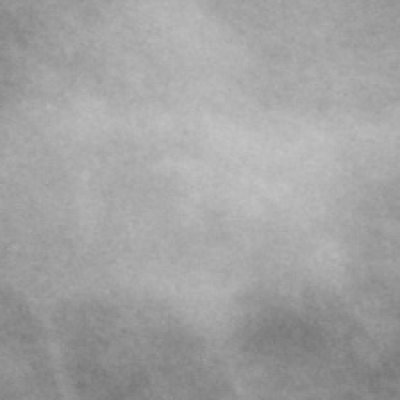
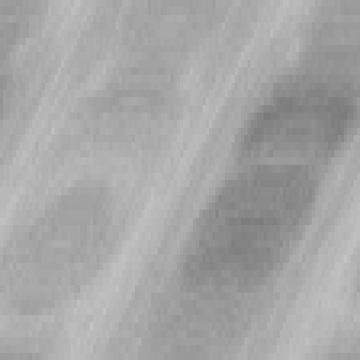
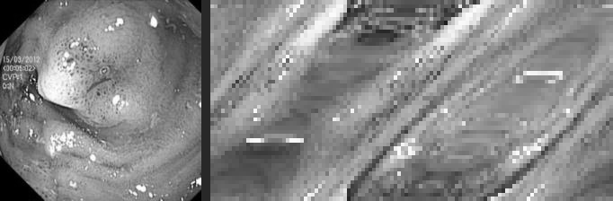

# Tusi-Couple Radial Filter for Medical Image Classification

A PyTorch research project testing whether a geometric pre-filter — inspired by
the **Tusi couple** (a small circle rolling inside a larger circle) — helps a
CNN classify medical images better than raw pixels do.

**Full narrated walkthrough with all results embedded: [`notebooks/walkthrough.ipynb`](notebooks/walkthrough.ipynb)**
— open it directly on GitHub to see everything without running anything, or run
it yourself (locally, VS Code, or Colab) with zero setup beyond `pip install`.

## The idea

For `N` evenly spaced angles around a lesion's center, sample `D` points along
each angle's diameter at harmonic (cosine), phase-shifted positions — derived
from the classical Tusi-couple construction, where a point on a small circle
rolling inside a larger one traces a diameter via `x(phi) = R*cos(phi)`. Stack
the results into an `(N, D)` grid (angle × radius) and feed that to a CNN
instead of the raw image.

**Mammography** — original crop next to its Tusi-filtered version:

| Original crop | Tusi-filtered |
|---|---|
|  |  |

**Polyp** — same idea, other domain (original crop on the left, Tusi-filtered on the right, combined in one image):



## Repo structure

Everything is organized by pipeline — pick the folder for the domain you care
about, everything you need is inside it:

```
core/                        Shared code both pipelines depend on
├── tusi_filter.py           TusiRadialFilter — the core transform
├── models.py                TusiCompatibleCNN + exploratory architectures
├── dataset.py                Synthetic dataset + shared transforms
├── training.py               Shared training-loop primitives
├── evaluation.py             Shared metrics + plotting
└── augmentation.py           Shared augmentation for exploratory scripts

mammography/                 Mammography pipeline (CBIS-DDSM, malignant vs. benign)
├── organize_dataset.py      One-time crop preprocessing (already run — see dataset/)
├── train.py                 Train baseline + Tusi branches
├── evaluate.py               Compute metrics, produce plots
├── explore_architectures.py Exploratory Tusi-only architecture variants
├── dataset/{train,test}/{benign,malignant}/   The actual crops used (committed)
└── results/                  Trained models, metrics, plots
    └── exploratory/           2D circular-pad + 1D signal variant results

polyp/                       Polyp pipeline (Kvasir-SEG + HyperKvasir, polyp vs. normal)
├── organize_dataset.py      One-time crop preprocessing (already run — see dataset/)
├── train.py                 Train baseline + Tusi branches
├── explore_architectures.py Exploratory Tusi-only architecture variants
├── evaluate.py               Compute metrics, produce plots
├── dataset/{train,test}/{normal,polyp}/       The actual crops used (committed)
├── dataset_signal/{train,test}/{normal,polyp}/   Every crop above, pre-transformed
│                              through TusiRadialFilter and saved — the literal,
│                              pixel-for-pixel input the Tusi models trained on
│                              (normally computed live in memory, materialized
│                              here for inspection; see core/build_tusi_signal_dataset.py)
└── results/                  Trained models, metrics, plots
    └── exploratory/{signal,aware}/   2D circular-pad + 1D signal variant results

tusi_filtered_examples/      Every example image used in the walkthrough, one
                              folder, consistently named (mammography_*, polyp_*)
notebooks/walkthrough.ipynb  The full story, pre-executed with embedded results
README.md, requirements.txt
```

Nothing here needs downloading — the committed `dataset/` folders in each
pipeline are the actual, small (a few MB), already-cropped images the results
below were produced from.

## Results

Two domains, same controlled comparison both times: baseline (raw pixels) vs.
Tusi (radial transform), identical CNN architecture (`TusiCompatibleCNN`,
~390K params — literally the same model both times), identical
hyperparameters. Only the input representation differs.

| Domain | Model | Accuracy | ROC-AUC | Sensitivity | F1 |
|---|---|---|---|---|---|
| Mammography (CBIS-DDSM) | Baseline | 0.632 | 0.626 | 0.237 | 0.339 |
| Mammography (CBIS-DDSM) | Tusi | 0.617 | 0.627 | 0.375 | 0.438 |
| Polyps (Kvasir-SEG) | Baseline | 0.848 | 0.970 | 0.670 | 0.786 |
| Polyps (Kvasir-SEG) | Tusi | 0.865 | 0.954 | 0.705 | 0.813 |

**Key finding**: Tusi consistently improves sensitivity over baseline in both
domains — but absolute performance is dominated by whether the label
genuinely matches visual appearance in a given domain. Mammography labels come
from biopsy, which can diverge from what a lesion looks like; polyp presence
is confirmed by direct visual annotation, no such divergence possible, and
both models score far higher there. Full explanation, with concrete examples
of the appearance-vs-biopsy divergence and the crop-size bug we caught and
fixed mid-project, is in the notebook.

## Exploratory architectures

The controlled comparison above always uses the identical `TusiCompatibleCNN`
for both branches (needed to isolate the representation as the only variable).
Separately, `explore_architectures.py` (in each pipeline) tests two
Tusi-only architectures that lean into the transform's actual structure —
not a fair A/B test, a ceiling estimate for how much the representation can
give if the model is built around it:

- **2D circular-pad CNN**: a regular 2D CNN, but the angle axis is padded
  circularly instead of with zeros, since angle 0 and angle N-1 are actually
  adjacent sweeps, not unrelated edges.
- **1D signal CNN**: treats each angle's row as its own independent 1D
  signal (a `Conv1d` per angle, weight-shared across angles), then combines
  the per-angle features across the (circular) angle axis in a second stage
  — rather than sliding a 2D kernel over the whole grid at once.

| Domain | Architecture | Accuracy | ROC-AUC | Sensitivity | F1 |
|---|---|---|---|---|---|
| Mammography | 2D circular-pad | 0.577 | 0.632 | 0.388 | 0.422 |
| Mammography | 1D signal | 0.617 | 0.615 | 0.350 | 0.421 |
| Polyp | 2D circular-pad | 0.667 | **0.981** | **0.995** | 0.713 |
| Polyp | 1D signal | **0.908** | 0.970 | 0.835 | **0.884** |

**Read**: on mammography, neither exploratory architecture beat the plain
shared CNN — architecture tweaks didn't move the needle, reinforcing that
mammography's ceiling is a data problem, not a model problem (see the
notebook). On polyp, the picture is different and more interesting:

- The **1D signal CNN clearly wins** across the board here — it's the best
  polyp result of any architecture tested, plain or exploratory. This is a
  reversal from mammography, where the signal approach was the weakest
  variant — consistent with a polyp being a genuine physical bump (the kind
  of clean, consistent boundary geometry the signal architecture is built to
  exploit), unlike mammography's inconsistent spiculation.
- The **2D circular-pad model has the highest AUC of anything tested**
  (0.981) but low accuracy (0.667) — it's calling almost everything "polyp"
  (99.5% sensitivity). The high AUC says the underlying discrimination is
  genuinely excellent; the low accuracy is a calibration problem at the
  default 0.5 threshold, not evidence the model is bad.

## Quickstart

```bash
git clone https://github.com/chichihayes/tusi-cnn
cd tusi-cnn
pip install -r requirements.txt
```

**To view everything (no execution needed):** open `notebooks/walkthrough.ipynb`
on GitHub, or in VS Code / Jupyter / Colab — all outputs are pre-rendered.

**To re-run training yourself**, from the repo root:
```bash
python mammography/train.py --epochs 20
python mammography/evaluate.py

python polyp/train.py --epochs 20
python polyp/evaluate.py
```
(Each script also works run from inside its own folder, e.g.
`cd mammography && python train.py`.)

**To re-run the exploratory architectures** (Tusi-only, see below):
```bash
python mammography/explore_architectures.py --architecture tusi_signal_cnn
python polyp/explore_architectures.py --architecture tusi_signal_cnn --out-dir polyp/results/exploratory/signal
python polyp/explore_architectures.py --architecture tusi_aware_cnn --out-dir polyp/results/exploratory/aware
```

## Reproducing from raw data (optional)

The committed `dataset/` folder in each pipeline already contains everything
needed to reproduce the results above — you do not need the raw source
datasets. If you want to rebuild the crops from scratch instead:

- **CBIS-DDSM**: [Kaggle mirror](https://www.kaggle.com/datasets/awsaf49/cbis-ddsm-breast-cancer-image-dataset) → extract to `mammography/raw_data/` → `python mammography/organize_dataset.py`
- **Kvasir-SEG**: [official download](https://datasets.simula.no/kvasir-seg/) → extract to `polyp/raw_data/Kvasir-SEG/`
- **HyperKvasir normal images**: [official download](https://datasets.simula.no/hyper-kvasir/), labeled-images subset only (`anatomical-landmarks/cecum` + `anatomical-landmarks/retroflex-rectum`) → `polyp/raw_data/hyperkvasir_normal/` → `python polyp/organize_dataset.py`
